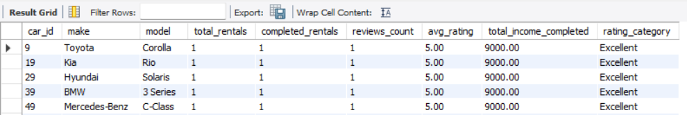
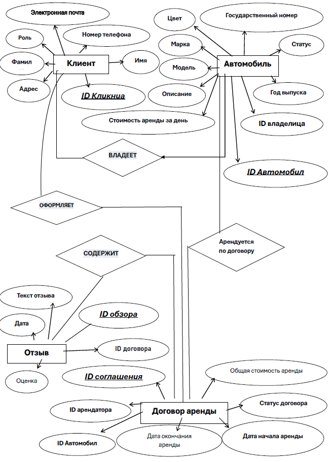

# Car Rental Database System (MySQL)


This repository contains the **design, implementation, and evaluation** of a

relational database system for a **car rental service**, developed using **MySQL**.

The project represents a **fully implemented and tested database**, including

real data, stored procedures, and analytical queries.

---

## Preview




## Table of Contents
- [Project Motivation](#project-motivation)
- [Technologies Used](#technologies-used)
- [Project Structure](#project-structure)
- [Database Design](#database-design)
- [Implementation Details](#implementation-details)
- [How to Run the Project](#how-to-run-the-project)
- [Results and Evaluation](#results-and-evaluation)
- [Academic Context](#academic-context)


## Project Motivation


Car rental systems require structured data management for vehicles, customers,

rentals, and payments.  

This project focuses on translating a **real-world business scenario** into a

normalized relational database with enforced integrity and queryable analytics.


---


## Technologies Used


| Component | Technology |

|---------|-----------|

| DBMS | MySQL |

| Query Language | SQL |

| Modeling | ER Diagrams |

| Data Volume | Thousands to hundreds of thousands of records |

| Environment | Local MySQL Server |


---


\## Project Structure


```text

RentingCar/

├── SQL/        # Database dump, schema, procedures, queries

├── Diagrams/   # ER diagrams

├── Assets/     # Supplementary figures

├── Results/    # Query outputs

└── Report.pdf  # Detailed analysis

```


---


## Database Design


The database was designed using **Entity–Relationship (ER) modeling**, followed by

conversion to a relational schema.


### Main Entities

- Customers

- Vehicles

- Rentals

- Payments

- Locations

- Vehicle Categories


All tables are **normalized**, and relationships are enforced using **foreign keys**.


---


## Implementation Details


### Key Features

- Primary and foreign key constraints

- Indexes for query optimization

- Stored procedures for bulk data insertion

- Realistic dataset for testing scalability

- Analytical queries for business insights


### Example Table Definition


```sql

CREATE TABLE Customer (

&nbsp;   customer\_id INT PRIMARY KEY AUTO\_INCREMENT,

&nbsp;   first\_name VARCHAR(50),

&nbsp;   last\_name VARCHAR(50),

&nbsp;   email VARCHAR(100) UNIQUE

);

```


### Stored Procedures


Stored procedures are used to automate data generation and insertion.


### Example Procedure


```sql

DELIMITER $$


CREATE PROCEDURE insert\_customers(IN n INT)

BEGIN

&nbsp; DECLARE i INT DEFAULT 0;

&nbsp; WHILE i < n DO

&nbsp;   INSERT INTO Customer(first\_name, last\_name, email)

&nbsp;   VALUES (CONCAT('Name', i), CONCAT('Surname', i), CONCAT('user', i, '@mail.com'));

&nbsp;   SET i = i + 1;

&nbsp; END WHILE;

END$$


DELIMITER ;

```


### Analytical Queries


The database supports analytical queries for decision-making.


```sql

-- Number of rentals per customer

SELECT customer\_id, COUNT(\*) AS total\_rentals

FROM Rentals

GROUP BY customer\_id;


-- Most rented vehicles

SELECT vehicle\_id, COUNT(\*) AS times\_rented

FROM Rentals

GROUP BY vehicle\_id

ORDER BY times\_rented DESC;


```

Query results are stored in the `Results/` directory.


## How to Run the Project


### Import Database


To import the full database (schema + data + procedures):


```bash

mysql -u root -p < SQL/dump.sql


```

After import, the database is immediately ready for querying.


---


## Results and Evaluation


* The database successfully handles large datasets


* Queries remain efficient due to indexing


* Stored procedures simplify bulk operations


* The system reflects real-world car rental workflows


Detailed analysis and screenshots are provided in Report.pdf.


## Diagrams

### ER Diagram


### Relational Schema / Structure


## What This Project Demonstrates

- Practical relational database design (not theoretical only)
- ER modeling to normalized relational schema
- Use of constraints and indexing for data integrity and performance
- Handling of large datasets in MySQL
- Writing analytical SQL queries for business insights


## Academic Context


This project was developed as part of coursework in **Database Systems**

at **Saint Petersburg Polytechnic University (SPbPU)**.


---


## Author


**Matin Dastanboo**  

MSc Student – Artificial Intelligence \& Machine Learning  

Peter the Great St. Petersburg Polytechnic University  

Saint Petersburg, Russia


